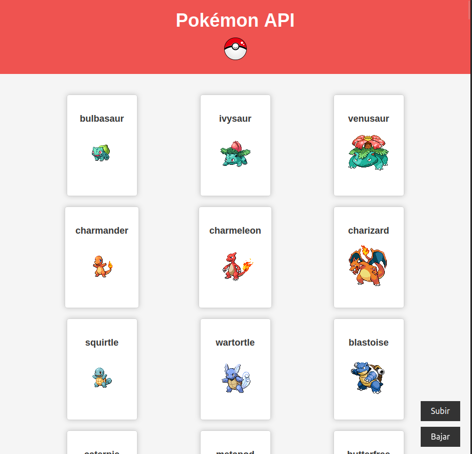

# Página Web de Pokémon API

Bienvenido a la página web de Pokémon, donde puedes explorar información sobre tus Pokémon favoritos. 

## Captura de Pantalla

*Interfaz de usuario*

## Características

- Información detallada sobre Pokémon.
- Botones interactivos.
- Diseño responsive para adaptarse a diferentes dispositivos.
- Botones flotantes para facilitar la navegación.

## Cómo Usar

1. Abre la página en tu navegador.
2. Explora la información de los Pokémon.
3. Haz clic en los botones navegar.
4. Disfruta de la experiencia Pokémon.

## Tecnologías Utilizadas

- HTML
- CSS
- JavaScript
- Biblioteca Swal (SweetAlert2) para los modales interactivos.

## Autor

- robersks

